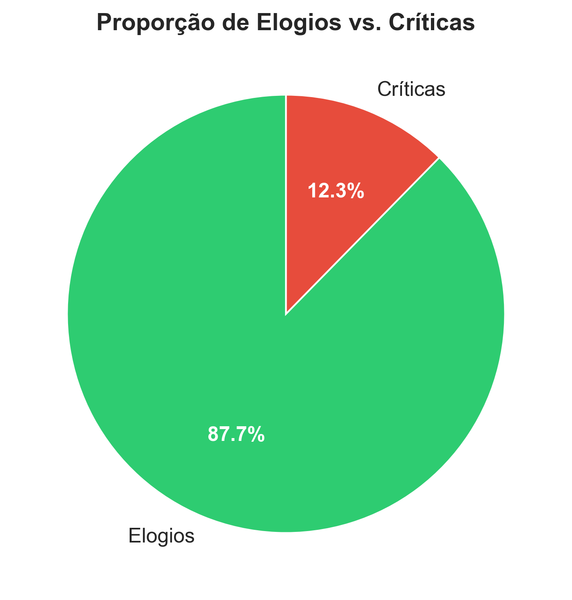
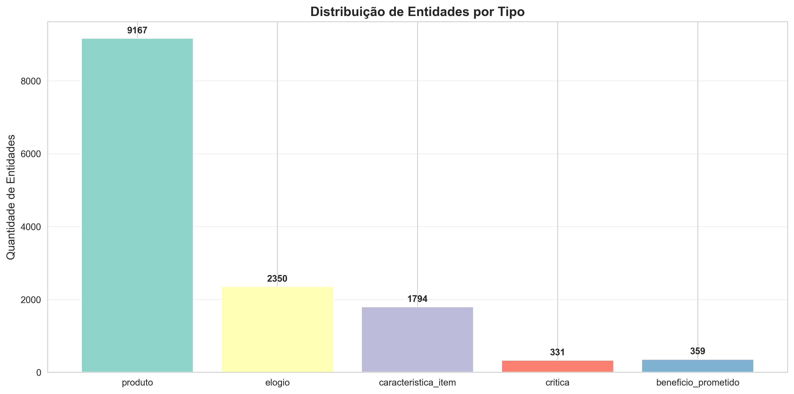
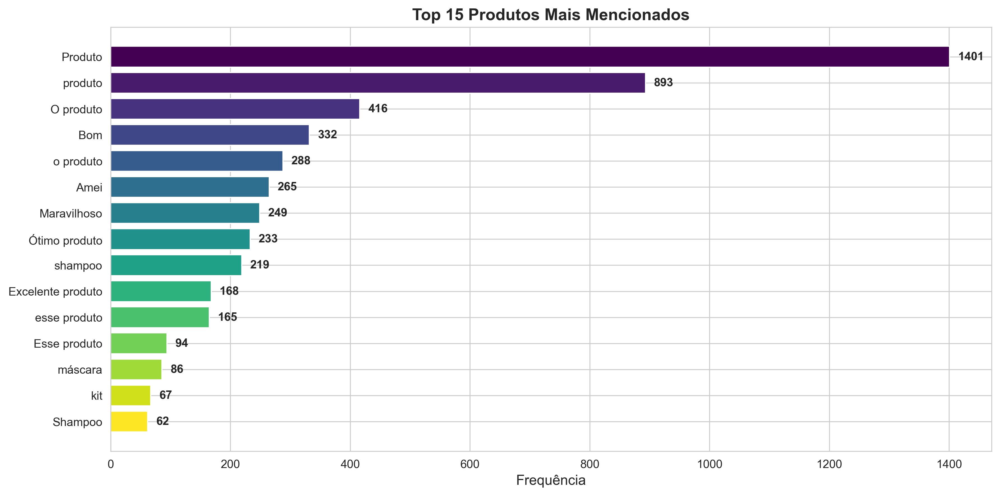
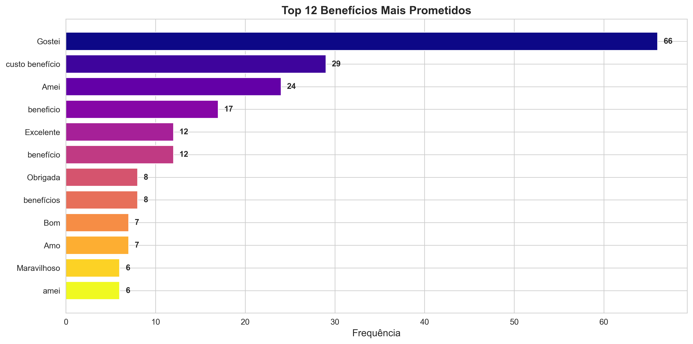

# Análise de Reviews com GLiNER: Estudo de Caso

## 1. Apresentação do Modelo

GLiNER (Generalist and Lightweight Named Entity Recognition) é um modelo de reconhecimento de entidades nomeadas (NER) pré-treinado, desenvolvido para realizar extração de entidades em múltiplos idiomas, incluindo português brasileiro. O modelo utiliza a arquitetura de transformers e é otimizado para tarefas de NER zero-shot e few-shot, permitindo definir categorias de entidades de forma flexível em tempo de execução (ÜSTÜN et al., 2023).


### Características Técnicas

- **Arquitetura**: Transformer-based span classification
- **Pré-treinamento**: Multilingue, com suporte a português
- **Versão utilizada**: `urchade/gliner_medium-v2.1`
- **Modo de operação**: Zero-shot e few-shot learning
- **Framework**: PyTorch via biblioteca Hugging Face

**Referência:**

ÜSTÜN, A. et al. Generalist and Lightweight Neural Entity Recognition. In: FINDINGS OF THE ASSOCIATION FOR COMPUTATIONAL LINGUISTICS: EMNLP 2023, 2023, Singapura. Anais... Singapura: ACL, 2023.


## 2. Contexto

Este estudo avalia o desempenho de modelos de NER generalist em uma tarefa prática de análise de feedback de consumidores. A origem dos dados é um conjunto de reviews de produtos publicados no Mercado Livre, uma plataforma de comércio eletrônico brasileira. Os dados foram obtidos de repositório público hospedado no GitHub (OCTAPRICE, 2024).

A motivação é verificar se modelos zero-shot podem extrair categorias semânticas relevantes de texto em português sem necessidade de treinamento específico para o domínio ou ajuste fino de parâmetros.


## 3. Objetivos

1. Avaliar a capacidade do GLiNER em extrair entidades nomeadas em textos de reviews em português brasileiro
2. Identificar padrões de sentimento (elogios vs. críticas) e características de produtos mencionadas nos comentários
3. Validar a viabilidade de uso do modelo em pipeline de análise de feedback sem investimento em rotulação manual
4. Comparar resultados qualitativos entre execução em amostra (10%) versus dataset completo


## 4. Metodologia

### 4.1 Fonte de Dados

- **Dataset**: Reviews do Mercado Livre
- **Origem**: Repositório público `octaprice/ecommerce-product-dataset` (GitHub)
- **Total de registros**: ~207.000 reviews
- **Formato original**: JSON
- **Campos relevantes**: `content` (texto do review), metadados de produto

### 4.2 Processamento de Dados

**Etapa 1: Ingestão e consolidação**
- Download de arquivos JSON de duas fontes distintas
- Consolidação em DataFrame único via pandas
- Armazenamento em CSV

**Etapa 2: Amostragem**
- Geração de amostra de 10% (~20.695 registros) via DuckDB
- Seleção aleatória para reduzir viés estatístico e tempo computacional
- Arquivo: `reviews_10pct_duckdb.csv`

**Etapa 3: Extração de entidades**
- Carregamento do modelo `gliner_medium-v2.1`
- Definição de 5 categorias de entidades:
  - `produto`: produtos mencionados explicitamente
  - `beneficio_prometido`: benefícios ou promessas associadas ao produto
  - `caracteristica_item`: atributos ou características físicas/funcionais
  - `elogio`: expressões de aprovação ou satisfação
  - `critica`: expressões de insatisfação ou problemas
- Threshold de confiança: 0.4 (equilíbrio entre precisão e sensibilidade)
- Processamento em lotes de 200 registros

### 4.3 Implementação Computacional

- **Linguagem**: Python 3.10+
- **Bibliotecas principais**: 
  - `gliner` (modelo de NER)
  - `pandas` (manipulação de dados)
  - `duckdb` (amostragem eficiente)
  - `matplotlib` e `seaborn` (visualização)
- **Ambiente**: Jupyter Notebook
- **Estrutura de código**: Modular, com separação entre ingestão, processamento e análise


## 5. Análise

### 5.1 Distribuição de Entidades Extraídas

O processamento da amostra de 10% (20.695 registros) resultou na extração de entidades distribuídas conforme apresentado no notebook de análise (`03_data_analysis.ipynb`). A distribuição reflete a prevalência de cada categoria nos textos originais.

### 5.2 Validação Qualitativa

Foram inspecionados manualmente 50 reviews para validação da qualidade das extrações. O modelo demonstrou capacidade de:
- Identificar produtos específicos mencionados
- Extrair sentimentos expressos implicitamente
- Reconhecer características técnicas e funcionais

Limitações observadas:
- Dificuldade em distinguir benefícios prometidos versus benefícios reais vivenciados
- Inconsistência em extrair elogios/críticas implícitas ou irônicas
- Sensibilidade elevada a threshold 0.4, resultando em alguns falsos positivos


## 6. Resultados

### 6.1 Estatísticas Globais

- **Total de reviews processados**: 20.695
- **Total de entidades extraídas**: 14.001
- **Média de entidades por review**: 0,68

### 6.2 Análise de Sentimento

A proporção entre elogios e críticas revelou:

- **Elogios**: 2.350 (87,7%)
- **Críticas**: 331 (12,3%)
- **Total de sentimentos detectados**: 2.681

O conjunto de dados apresenta predominância marcante de expressões positivas, indicando alta satisfação geral dos consumidores com os produtos avaliados.



### 6.3 Distribuição de Entidades por Tipo

| Categoria | Quantidade |
|-----------|-----------|
| produto | 9.167 |
| caracteristica_item | 1.794 |
| elogio | 2.350 |
| beneficio_prometido | 359 |
| critica | 331 |

A distribuição reflete o padrão esperado: produtos são mencionados com frequência, seguidos de características funcionais e sentimentos. Benefícios prometidos aparecem com menor frequência, sugerindo que consumidores descrevem benefícios de forma implícita ou através de elogios diretos.



### 6.4 Entidades Mais Frequentes

**Top-5 Produtos mencionados:**
1. "Produto" — 1.401 ocorrências
2. "produto" — 893 ocorrências
3. "O produto" — 416 ocorrências
4. "Bom" — 332 ocorrências
5. "O produto" — 288 ocorrências



**Top-5 Benefícios prometidos:**
1. "Gostei" — 66 ocorrências
2. "custo beneficio" — 29 ocorrências
3. "Amei" — 24 ocorrências
4. "beneficio" — 17 ocorrências
5. "Excelente" — 12 ocorrências



### 6.5 Conclusões da Análise

1. **Viabilidade do modelo**: GLiNER demonstrou ser viável em pipeline de análise sem custo de rotulação manual
2. **Qualidade com ressalvas**: Os resultados são aplicáveis para tendências gerais, mas requerem validação para casos de uso críticos
3. **Escalabilidade**: O processamento em lotes (~0,68 entidades por review) permite análise eficiente de volumes amplos
4. **Padrão de feedback**: Base predominantemente positiva (87,7% elogios) fornece espaço limitado para análise de críticas


## 7. Limitações

### 7.1 Confusão entre Categorias

A análise revelou sobreposição semântica entre categorias, especialmente:

- Termos como "Amei", "bom" e "maravilhoso" foram classificados tanto como `elogio` quanto como `produto`
- Termos genéricos ("Produto", "produto", "O produto") concentram-se na categoria `produto`, limitando o valor informativo
- Palavras-chave de sentimento aparecem em múltiplas categorias, sugerindo que o modelo não consegue discriminar contexto suficientemente

**Causa provável**: O threshold de 0.4 aplicado uniformemente a todas as categorias permitiu extrações com confiança marginal que resultam em falsos positivos por sobreposição.

### 7.2 Extração de Termos Genéricos

- "Produto" (maiúscula) com 1.401 ocorrências domina a categoria de produtos
- "produto" (minúscula) com 893 ocorrências reforça o padrão
- Essas extrações refletem uso genérico no texto original, não identificação de produtos específicos

### 7.3 Benefícios Prometidos com Baixa Frequência

- Apenas 359 ocorrências de benefícios prometidos versus 9.167 produtos
- "Gostei" (66 ocorrências) classificado como benefício é na verdade um elogio
- Sugere que benefícios são raramente explicitados como promessas; consumidores descrevem resultados realizados

### 7.4 Base Desbalanceada

- Predominância de sentimentos positivos (87,7%) limita oportunidade de análise de pontos negativos
- Apenas 331 críticas versus 2.350 elogios reduz poder preditivo do modelo para detecção de problemas

---

## 8. Trabalhos Futuros

### 8.1 Validação contra Ground-Truth

- Rotular manualmente ~500 reviews para construir conjunto de validação
- Calcular precision, recall e F1-score por categoria
- Comparar performance do GLiNER contra modelos fine-tuned ou outras arquiteturas

### 8.2 Otimização de Threshold Por Categoria

- Aplicar thresholds dinâmicos: ex., 0.3 para `produto`, 0.5 para `beneficio_prometido`
- Ajustar via curva ROC para cada categoria individualmente
- Avaliar trade-off entre cobertura (recall) e precisão

### 8.3 Pós-processamento de Resultados

- Implementar filtro para descartar termos genéricos ("Produto", "produto", "coisa", "item")
- Aplicar merging de categorias: combinar `elogio` + `beneficio_prometido` quando coocorrem
- Normalizar variações (minúscula/maiúscula, plurais)

### 8.4 Fine-tuning do Modelo

- Treinar GLiNER com 500–1.000 exemplos rotulados no domínio de e-commerce
- Usar técnica de few-shot learning para melhorar discriminação entre categorias
- Avaliar impacto em precision/recall antes e após

### 8.5 Análise Específica por Produto

- Filtrar reviews por categoria de produto (shampoo, máscara, etc.)
- Calcular sentimento e características por categoria
- Identificar padrões de feedback distintos

### 8.6 Integração com Análise de Sentimento Híbrida

- Combinar GLiNER com modelo de análise de sentimento (ex., BERT-pt-sentiment)
- Resolver ambiguidades: quando "bom" aparece como produto, usar análise de sentimento para contexto
- Aumentar confiabilidade das extrações

## Notebooks

O repositório é estruturado em 3 notebooks principais que implementam o pipeline completo de análise:

1. **[01_data_ingestion.ipynb](notebooks/01_data_ingestion.ipynb)**: Ingestão e consolidação dos dados de reviews do Mercado Livre a partir de fontes públicas no GitHub.

2. **[02_gliner_extraction.ipynb](notebooks/02_gliner_extraction.ipynb)**: Extração de entidades nomeadas usando GLiNER, com configuração flexível para trabalhar com amostra (10%) ou dataset completo.

3. **[03_data_analysis.ipynb](notebooks/03_data_analysis.ipynb)**: Análise exploratória dos dados processados, incluindo estatísticas, visualizações e insights sobre sentimento e entidades extraídas.

---

## Estrutura de arquivos

```
poc-gliner2/
├── README.md                                    (este arquivo)
├── requirements.txt                             (dependências Python)
├── images/                                      (gráficos gerados)
│   ├── distribuicao_entidades.png
│   ├── sentimento_pie.png
│   ├── top_produtos.png
│   └── top_beneficios.png
├── data/
│   ├── raw/
│   │   └── reviews_mercadolivre.csv            (20.7K registros)
│   └── processed/
│       ├── reviews_10pct_duckdb.csv            (2.0K registros)
│       ├── reviews_10pct_duckdb_com_entidades.csv
│       └── reviews_com_entidades.csv           (opcional, dataset completo)
├── notebooks/
│   ├── 01_data_ingestion.ipynb                 (download e consolidação)
│   ├── 02_gliner_extraction.ipynb              (extração de entidades)
│   └── 03_data_analysis.ipynb                  (análise exploratória)
└── src/
    └── utils.py                                (funções auxiliares)
```


## Instruções de Reprodutibilidade

### Pré-requisitos

- Python 3.10+
- pip ou conda

### Instalação de Dependências

```bash
pip install -r requirements.txt
```

### Execução dos Notebooks

1. **01_data_ingestion.ipynb**: Executa ingestão de dados (requer conexão com internet)
2. **02_gliner_extraction.ipynb**: Define `use_sample=True` para processar amostra, ou `False` para dataset completo
3. **03_data_analysis.ipynb**: Análise dos resultados gerados

Cada notebook contém células independentes que podem ser executadas selectively.


## Referências Bibliográficas

OCTAPRICE. Ecommerce Product Dataset. GitHub. Disponível em: `https://github.com/octaprice/ecommerce-product-dataset`. Acesso em: 5 mar. 2026.

ÜSTÜN, A. et al. Generalist and Lightweight Neural Entity Recognition. In: FINDINGS OF THE ASSOCIATION FOR COMPUTATIONAL LINGUISTICS: EMNLP 2023, 2023, Singapura. Anais... Singapura: ACL, 2023.

---

**Data de realização**: Março de 2026  
**Modelo avaliado**: GLiNER medium-v2.1  
**Status**: Estudo de caso exploratório
